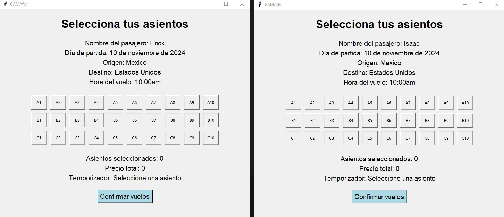
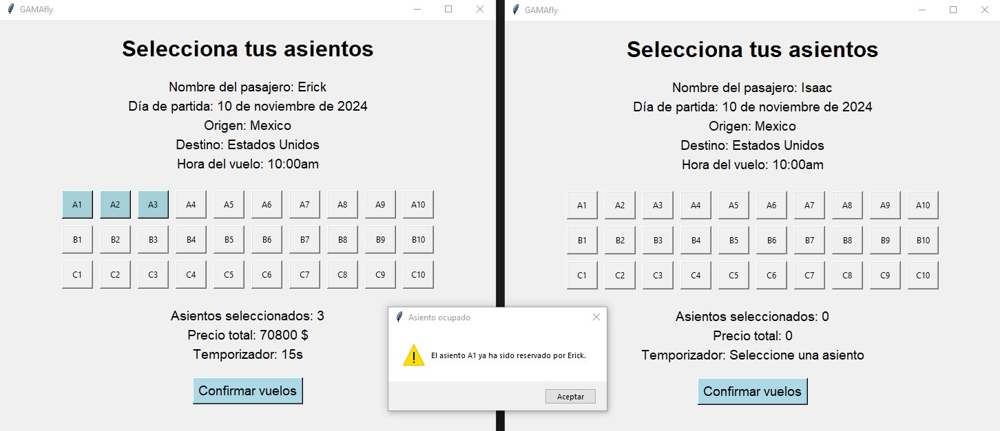

# Gamafly
GAMAfly es un pequeño proyecto de escritorio desarrollado en Python. Este programa permite a los usuarios seleccionar y reservar asientos en un vuelo, con un enfoque en la programación paralela, mediante el uso de semaforos para los asientos. El objetivo es que los usuarios pueden seleccionar asientos de manera interactiva, con un temporizador para completar la selección antes de la expiración.

## 🖥️ Visualización 
### Interfaz de la selección de asientos de un vuelo
El programa puede ejecutar varias interfaces simulando varios asientos, si cualquiera de los usuarios selecciona un asiento entonces se bloquea para los demás usuarios y se activa un contador, si el usuario no compra su asiento seleccionado entonces se cancela su selección y el asiento es liberado para que otros usuarios puedan comprar los asientos

### Validación, un segundo usuario intenta seleccionar un asiento que ya fue seleccionado por otro usuario  

## ⚙️ Características principales:
- `Interfaz gráfica (Tkinter)`: La ventana muestra los asientos disponibles en forma de botones. Cada botón cambia de color dependiendo del estado del asiento (disponible, en proceso de compra, comprado).
- `Concurrencia (hilos)`: Cada cliente se maneja en un hilo independiente, lo que permite que múltiples clientes intenten comprar boletos de manera simultánea.
- `Semáforo`: Un semáforo asegura que solo un cliente pueda modificar el estado de un asiento a la vez (para evitar conflictos entre hilos).
- `Simulación de procesos`: Se simula un tiempo aleatorio para el proceso de compra y la posibilidad de que un cliente cancele la compra antes de completarla.
